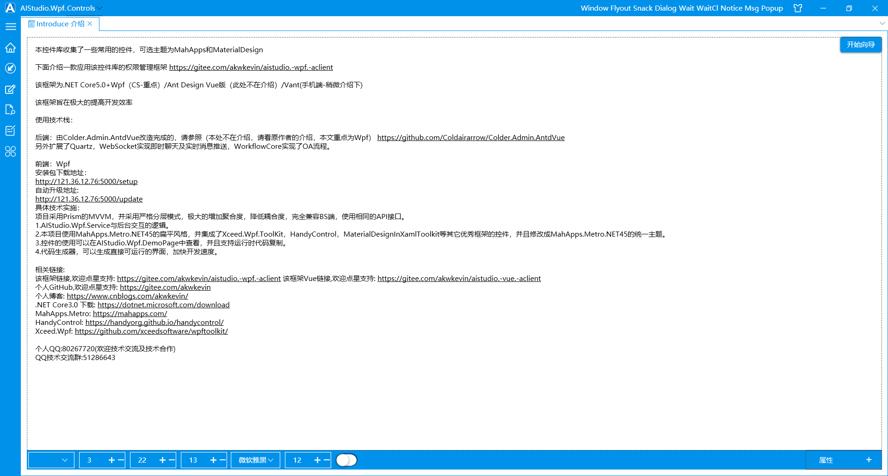

<section id="nice" data-tool="mdnice编辑器" data-website="https://www.mdnice.com" style="font-size: 16px; color: black; padding: 0 10px; line-height: 1.6; word-spacing: 0px; letter-spacing: 0px; word-break: break-word; word-wrap: break-word; text-align: left; font-family: Optima-Regular, Optima, PingFangSC-light, PingFangTC-light, 'PingFang SC', Cambria, Cochin, Georgia, Times, 'Times New Roman', serif;">
一个Wpf控件库

本控件库，结合了MahApps.Metro，Material-Design，HandyControl，PanuonUI，Xceed等控件库，做了一个集成，并有部分自定义的控件，供大家参考使用，以下为控件库截图，本控件库会保持定期维护定期更新，欢迎大家光临。(如果我使用了您的控件，没有在本文提出，请联系我，我给您加上)

技术交流
个人QQ:80267720 QQ技术交流群:51286643 个人博客:https://www.cnblogs.com/akwkevin/

更多
界面截图请到博客介绍：https://www.cnblogs.com/akwkevin/p/16297568.html